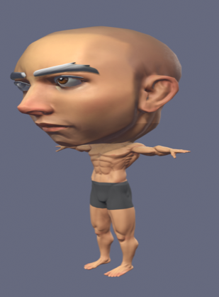
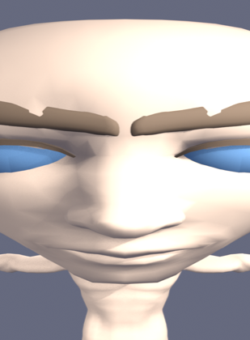
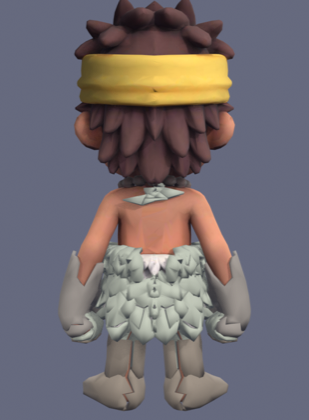

# Personaje chibi militar: qué se probó y por qué está parado

Fecha: 2026-09-26 · Estado: **bloqueado, necesita decisión**

Encargo: sustituir el personaje por un chibi militar hecho a partir del pack
*Universal Base Characters* de Quaternius, con personalización en runtime (piel,
ojos, pelo, peinado, ropa, chaleco, pantalones), 26 animaciones y dos mapas
nuevos con los packs de KayKit y Kenney.

Esto documenta lo que se comprobó, lo que se intentó y por qué no se ha
integrado nada. **El repositorio queda exactamente como estaba**, verde.

## Tres hechos que cambian el encargo

### 1. El proyecto no es Unity

El encargo pide Animator Controller, Avatar humanoide, prefabs,
ScriptableObjects, Rigidbody/CharacterController y "preparado para exportación a
Unity". Este proyecto es **TypeScript en navegador**: Three.js para render,
Colyseus para red, Rapier para física y Electron para escritorio. No hay Unity ni
puede haberlo sin rehacer el juego entero, que es justo lo que el encargo
prohíbe.

Todo lo pedido tiene equivalente aquí y ya existe: el "Animator Controller" es
`PlayerEntity` + `WeaponAnimator`, el "prefab" es la escena de partida, el
"CharacterController" es la cápsula cinemática de Rapier en
`packages/shared/src/physics`, y el networking es el `Schema` de Colyseus.

### 2. El pack de personajes no trae ni una animación

Se piden 26 clips (Idle, Walk, Run, Sprint, Crouch, Jump, Fall, Land, Strafe,
Hit reaction, Death, Aim, Reload, Fire, Melee, Knife inspection…).

El `.gltf` del pack tiene `animations: []`. La versión gratuita solo incluye las
mallas; los `.blend` riggeados están en la versión de pago. Esas animaciones hay
que **animarlas a mano**, no se pueden "integrar".

Hoy el juego las resuelve de forma procedural (`PlayerEntity` para el cuerpo,
`WeaponAnimator` para el arma) y cubre locomoción, agachado, salto, apuntado,
disparo, recarga, muerte, emotes e inspección. Ampliar esa vía a los estados que
faltan (strafe, retroceso, reacción al daño) es trabajo normal. Sustituirla por
clips exige un animador.

### 3. El modelo base es realista, no cartoon

| | Base Quaternius | Personaje actual |
| --- | --- | --- |
| Altura | ~1,75 m | 1,20 m (cápsula de juego) |
| Cabeza | 13 % de la altura | 43 % |
| Huesos | 65, convenio Unreal | 19, convenio del juego |
| Mallas | cuerpo + ojos + cejas | una sola |
| Materiales | textura fotorrealista | una textura |

## Lo que se intentó

### Intento 1 — Achibar el modelo base

Escalado de huesos en pose, horneado como pose de reposo, y ajuste a la altura
de la cápsula. **La parte medible salió perfecta**: 1,200 m exactos, cabeza al
44 %, hueso del cuello en z = 0,675 (justo el `Y_CHIN` del contrato de
proporciones), y los 19 huesos renombrados al convenio del juego.

Pero un humano realista escalado no es un cartoon: es un culturista con la
cabeza en forma de huevo.

### Intento 2 — Receta cartoon sobre el intento 1

Cráneo redondeado, ojos agrandados (son malla aparte) y color plano en vez de la
textura fotográfica.

Peor. Los ojos agrandados asoman por unos párpados modelados de forma realista y
la cara queda como una máscara. La nariz y los labios siguen siendo realistas
bajo el color plano.

### Intento 3 — Vestir al personaje actual

El caveman actual **sí es un buen chibi**: cara cartoon, proporciones correctas y
rig ya en el convenio del juego. Solo le falta ser militar. Se intentó generar
las prendas duplicando las zonas del propio cuerpo seleccionadas por peso de
hueso, hinchadas hacia fuera, cada una con su material recolorable.

También peor: las prendas heredan la geometría del taparrabos y del pelo y salen
como jirones.

## Conclusión

Convertir una cabeza esculpida realista en una cartoon **exige esculpir**, no
escalar. Las tres vías automatizables dan un resultado peor que el personaje que
el juego ya tiene, y se descartan.

## Y hay un bloqueo de fondo para la personalización

El personaje actual es **una sola malla con un único material texturizado**, con
los ojos y la ropa pintados en la textura. Cambiar en runtime el color de piel,
de ojos o de ropa es imposible sin rehacer el personaje: no hay canales que
tocar.

Es decir, la personalización que pide el encargo **no es independiente** del
personaje nuevo: lo necesita.

## Qué haría falta para desbloquearlo

Por orden de coste:

1. **Un personaje cartoon con las partes separadas.** Encargarlo, comprarlo
   hecho, o esculpirlo. El contrato que tiene que cumplir ya está escrito y
   verificado por tests: 1,20 m de alto, cabeza al 43 %, los 19 huesos de
   `BONE_MAP`, y **una malla y un material por canal de color** (piel, ojos,
   pelo, camisa, chaleco, pantalones, botas, guantes).
   Con eso, el sistema de personalización y su sincronización son trabajo
   normal de un par de días.

2. **Los peinados sí sirven tal cual.** El pack trae seis, como objetos
   separados y con variante ya emparentada al hueso de la cabeza. Encajan en
   cuanto el personaje base no lleve el pelo modelado encima.

3. **Las animaciones**: o se amplía la vía procedural actual (barato, y ya
   funciona) o se contrata a alguien que anime los 26 clips.

## Los mapas quedan fuera por otra razón

Los packs de KayKit y Kenney están bien y sirven. No se han tocado los mapas
porque el encargo pide **borrar los dos actuales**, que hoy funcionan, están
validados por `maps.test.ts` y tienen arte generado. Cambiarlos sin nadie a quien
preguntar, en la misma tanda que un personaje que no ha salido, es arriesgar lo
que ya está bien a cambio de nada.

Los assets quedan en el repositorio y listos: se versiona solo el glTF/GLB que
usa este motor (2,1 MB); los mismos modelos venían repetidos en fbx, obj y
proyectos de Unity y Unreal, 180 MB que no pintan nada aquí.
